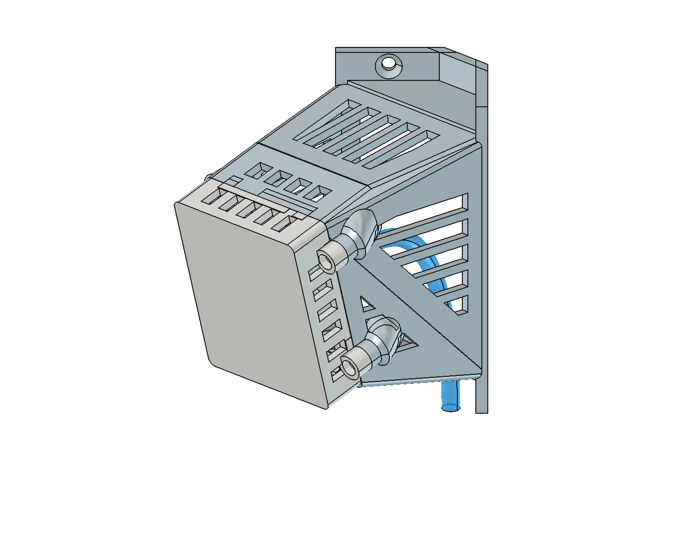

# Apollo R PRO-1 fixed-angle wall and corner enclosure

A community enclosure for the **Apollo Automation R PRO-1**, designed with FreeCAD and Python. Print the direction you need: the mount has no ball joint or friction-fit backplate to slip under cable load. A bolted lid retains the main PCB on segmented rails, with space and ventilation for PoE and the optional radar/CO₂ modules.

*Corner preset; the blue cable is a reference preview, not a printed tube.*

**Two assembly parts:** body and lid. The front sensor window is 1.2 mm thick; actual radar performance and long-term PETG behaviour still need checking in your installation.

This is an independent community project, not an official Apollo product. Thanks to [Apollo Automation](https://apolloautomation.com/products/r-pro-1) for providing the PCB and case references. See [attribution and reuse terms](ATTRIBUTION.md).

## Edit your model in FreeCAD — recommended workflow

**Open a supplied FreeCAD model, edit its Parameters, then run the rebuild macro inside FreeCAD.** You do not need to edit Python or use a terminal for normal parameter changes.

1. Install **FreeCAD** and Qhull's **qconvex** executable. This project was tested with FreeCAD 1.1.3 on Linux; qconvex must be on the PATH visible to FreeCAD.
2. Download this whole repository using **Code → Download ZIP** and extract it. Keep `Rebuild.FCMacro` beside `build_mount.py`.
3. In FreeCAD, use **File → Open** to open a supplied `.FCStd`, such as `output/corner/apollo-mount.FCStd`. Use **File → Save As** for a working copy if you want to preserve the preset.
4. Select **Parameters – edit, then run Rebuild.FCMacro** in the model tree, then the **Data** tab in the Property view.
5. Double-click the values you want to change: for example **Yaw**, **Pitch**, **RearChamberDepth** or **CableEnabled**. Enter lengths in millimetres and angles in degrees, and press Enter to finish each edit.
6. With that model's tab active, open **Macro → Macros…**. Set the macro location to the extracted repository folder if necessary, select **Rebuild.FCMacro**, and click **Execute**.
7. Wait for **“Apollo rebuilt…”** in FreeCAD's status bar/Report view, then inspect the updated model. The macro saves the new CAD and printable **body.stl** and **lid.stl**, plus STEP files, in **`output/custom/`**.
8. Copy that output folder to a named location to keep this version, then open the new STLs in your slicer and review them before printing.

**Editing a value, saving or pressing Recompute alone does not regenerate the geometry. Run the macro after changing parameters.** A successful rebuild overwrites matching files in `output/custom`, even when the source CAD file was saved elsewhere. Preserve any previous custom exports you want to keep before rebuilding. If the macro reports an error, correct it and rerun; old exports do not represent the new settings.

Existing supplied CAD files include the PCB reference, so the normal workflow above does not require decompressing the separate OBJ.

- **Full walkthrough and troubleshooting:** [FreeCAD guide](docs/FREECAD.md).
- **Every setting explained:** [editable and calculated parameters](docs/PARAMETERS.md).
- **Print an existing version:** use the model downloads below and the [printing guide](docs/PRINTING.md).
- **AI assistance and advanced automation:** [AI/developer guide](docs/AI-WORKFLOW.md).

## Included models

These values were read from each saved CAD document for this publication. Defaults in the parameter reference describe new CLI builds; saved models can have different settings.

| Version | Mount | Yaw / pitch | Requested rear chamber | Cable | Files |
|---|---|---|---|---|---|
| Flat | Flat wall | 0° / 0° | 30 mm | On | [CAD](output/flat/apollo-mount.FCStd) · [body](output/flat/body.stl) · [lid](output/flat/lid.stl) |
| Corner | 90° inside corner | 0° / 15° | 30 mm | On | [CAD](output/corner/apollo-mount.FCStd) · [body](output/corner/body.stl) · [lid](output/corner/lid.stl) |
| Right-facing | Flat wall | +90° / 0° | 30 mm | On | [CAD](output/yaw90/apollo-mount.FCStd) · [body](output/yaw90/body.stl) · [lid](output/yaw90/lid.stl) |
| Left-facing | Flat wall | −90° / 0° | 30 mm | On | [CAD](output/yaw_minus90/apollo-mount.FCStd) · [body](output/yaw_minus90/body.stl) · [lid](output/yaw_minus90/lid.stl) |
| Custom corridor | 90° inside corner | −39° / +4° | 1 mm | Off | [CAD](output/custom/apollo-mount.FCStd) · [body](output/custom/body.stl) · [lid](output/custom/lid.stl) |
| Entrance snapshot | 90° inside corner | −39° / +4° | 1 mm | Off | [CAD](output/Final-prints/entrance.FCStd) · [body](output/Final-prints/entrance.stl) · [lid](output/Final-prints/lid.stl) |

The five preset folders also contain individual STEP solids and `assembly.step`. All corner examples have a 10 mm corner-tip setback and top/bottom closures; their middle remains open. A requested 1 mm chamber does **not** mean the PCB is 1 mm from the wall: electronics space and any additional wall clearance are separate.

`output/custom` is also the macro's working export folder and is overwritten on a successful rebuild. Copy an example you want to keep before experimenting. The entrance snapshot is kept separately as an example of that workflow.

The STLs contain printable parts only. Native `.FCStd` documents include the original PCB as a visible guide. Orange clearance objects are simplified space reservations, not detailed models of the missing modules.

## How it works

`build_mount.py` calls FreeCAD's native Python geometry API: create solids, join them, subtract vents and clearances, then validate and export. Qhull's `qconvex` constructs the rear chamber envelope. No FreeCAD MCP server is required.

The model is **parametric through the generator**, not through a conventional sketch/Pad/Pocket feature history. Editing the `Parameters` object changes inputs; running `Rebuild.FCMacro` regenerates the shapes. Editing a value or pressing Recompute alone does not regenerate them.

## Advanced automation

For scripted builds, source-code changes or development tests, see the [AI/developer guide](docs/AI-WORKFLOW.md#advanced-command-line-builds). These are optional alternatives to editing parameters and running the macro in FreeCAD.

## Validation and limitations

The generator checks connected valid solids, reserved-component and wall collisions, body/lid overlap, closed STL meshes and the A1's 256 mm build-volume limit. These checks do not verify every physical module, print orientation, support choice or cable insertion manoeuvre.

Additional developer tests are described in the [AI/developer guide](docs/AI-WORKFLOW.md#required-verification). The full geometry suite can take several minutes and uses the included PCB reference document and official case STEP. Optional historical FEM scripts are included; see [AI workflow / structural screening](docs/AI-WORKFLOW.md#structural-screening). They are comparative solid-material calculations, not a prediction of heat-induced creep or printed PETG service life.

The supplied PCB mesh omits the plugged-in LD2450, optional LD2412 and CO₂ daughterboards. Front height 13.9 mm, rear height 16.9 mm and side overhang 1.4 mm came from physical measurements. Verify your revision with the body, lid, actual nuts and Ethernet connector before printing a batch.

## Contribute

Share your printer/material, parameter values, a photo of the problem and a small reproducible example in an issue or pull request. Keep PCB grips, fastener seats, vent reinforcement and cable clearances intact when changing the chamber. Please distinguish geometric validation from actual fit and sustained-PoE testing.

## License

Shared under [CC BY-NC-SA 4.0](LICENSE.md): attribute the creators, use noncommercially, and share adaptations under the same terms. See [ATTRIBUTION.md](ATTRIBUTION.md) for Apollo's original files and the changes made here. Apollo names and logos remain their owners' marks; this project is not endorsed by Apollo.
