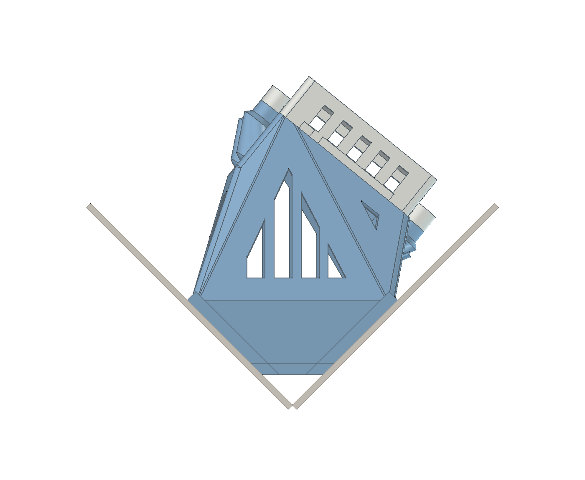
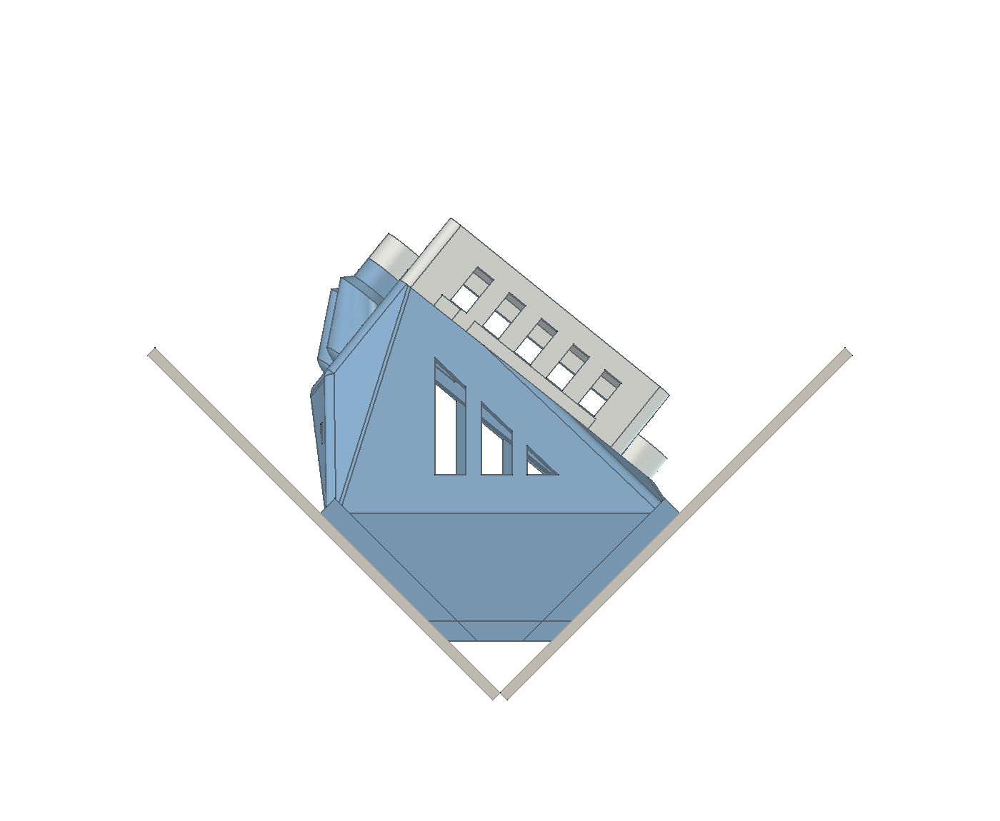
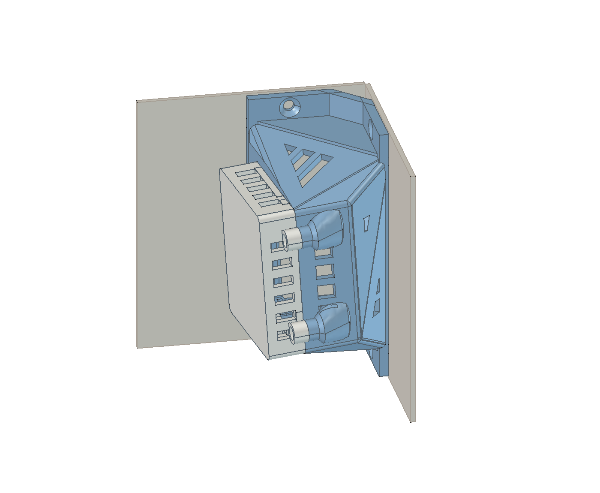
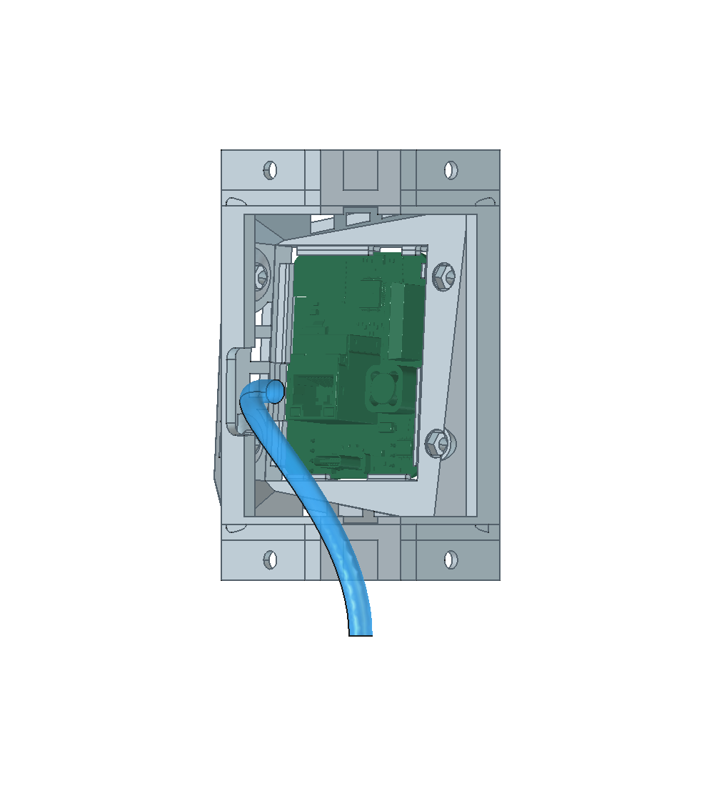
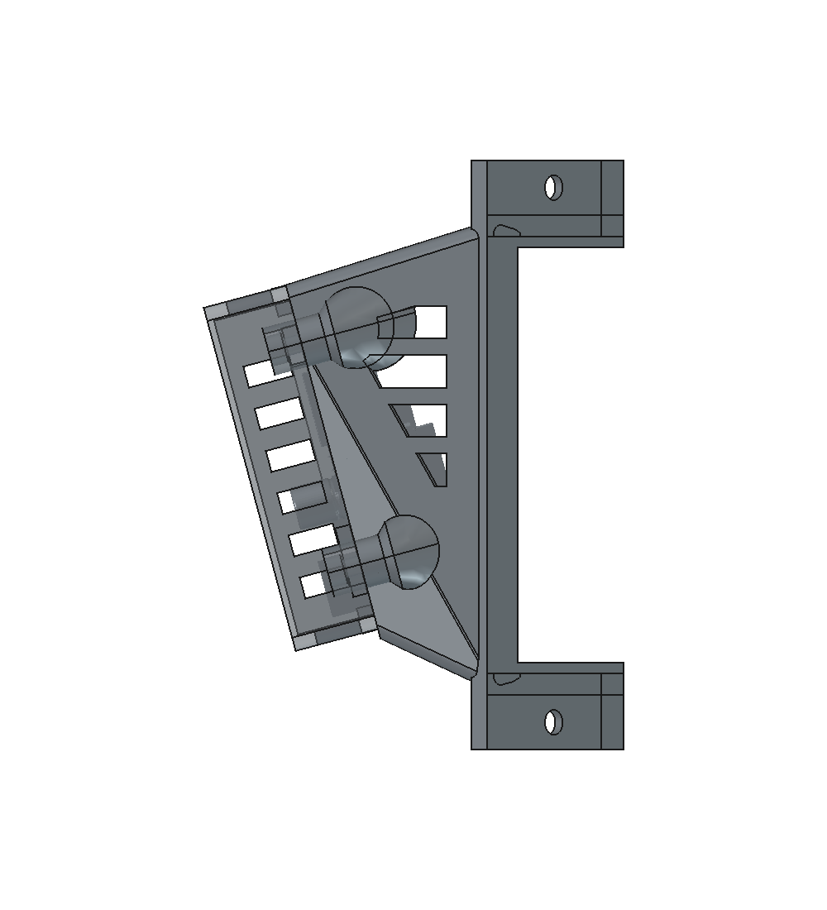

# Experimental compact corner mount

Branch: `experiment/compact-corner`. This is a geometry prototype for bringing the R PRO-1 closer to an inside corner while preserving the existing PCB holders, cover and mounting pads. It is not merged into `main`.

## Try it in FreeCAD

Open [the compact corridor CAD](../output/compact-corner-poe/apollo-mount.FCStd) using the generator and macro from **this branch**. It starts with:

| Parameter | Value |
|---|---:|
| Corner | Yes |
| CompactCorner | Yes |
| Yaw / Pitch | −39° / +4° |
| CornerAngle / CornerSetback | 90° / 10 mm |
| RearChamberDepth | 1 mm |
| CableEnabled | Yes |

Select **Parameters → Data**, change the values, then run **Macro → Macros… → Rebuild.FCMacro → Execute**. `RearChamberDepth` now adds forward stand-off from the calculated compact position; increase it if your real cable needs more space. It no longer measures an empty gap ahead of the old flat rear frame when CompactCorner is enabled.

`CompactCorner = No` restores the normal placement rules. It defaults to No and has no effect on flat-wall mounts. On an older document, run the branch's macro once to add the new property before enabling it. Existing saved examples and the main branch have not been replaced.

Only [the new body STL](../output/compact-corner-poe/body.stl) and [the existing shared lid](../output/lid.stl) are needed to print. The experimental folder also provides body STEP and assembly STEP files. Rebuilds still write into `output/custom`; preserve any work there first.

## What changed

The original placement used a full-depth, full-height bounding box including the widest screw housings, and the same sideways shift used for flat-wall mounts. The chamber also stopped at the flat plane across the front of the corner bracket, leaving the space behind it unused.

Compact mode separates the rigid PCB holder, cover and screw housings from the rear component-clearance envelope, balances clearance against both walls, and lets the chamber taper into the hollow corner. The empty rear bay no longer acts as a full-width rigid box during placement. The back stays open: the existing corner frame supplies the wall-contact material, with end closures and screw supports retained. The mounting pads and screw centres stay in place. The PCB, lid and retention rails remain rigid. This is the minimum of the conservative placement envelopes plus the requested extra stand-off, not proof of the absolute smallest possible enclosure.

The provisional rigid plug envelope is included when CableEnabled is Yes. The existing route generation and reinforced intersection cutouts then run in the new position. When CableEnabled is No, cable parameters remain ignored; that setting does not establish plug or bend clearance.

## Cable assumption

This prototype assumes a cable arriving through the wall behind the PCB, or a sufficiently flexible cable whose real clearance you will check. The saved cable-enabled route uses the existing 20 mm bend-radius input and automatically places its entry behind the wall (ActualCableEntryDepth = −62 mm relative to the rear-frame front plane). It therefore needs a real wall opening if followed as drawn.

The geometry checks clear the provisional 17 × 18 × 15 mm connector and displayed cable from the body. They do not establish that an external stiff cable can bend down in the same space. Use RearChamberDepth to add space, or configure the route for the actual cable. No assumed cable bend limit has been reduced.

## Comparison with the recent corridor print

Both versions keep −39° yaw, +4° pitch and the requested depth value 1 mm. The original print has cable processing off; the prototype explicitly enables it to check the provisional plug/route.

| Measure | Original | Compact |
|---|---:|---:|
| PCB centre X in fixed frame | −13.99 mm | +1.08 mm |
| PCB centre Z from theoretical corner | 76.43 mm | 59.46 mm |
| Forward projection reduction | — | **16.97 mm** |

The centre shifts sideways by 15.07 mm as well as moving back. The 16.97 mm figure is along the corner bisector, not perpendicular to either wall. Read-only `CornerDepthSaving` compares the two placement rules at the same parameter values; `BoardDistance` still reports actual PCB distance ahead of the rear-frame front plane. `AdditionalWallClearance` is zero in compact mode because placement is calculated directly.

With the redundant rear panels removed, the compact body's solid CAD volume is about 49.0 cm³ versus 55.7 cm³ for the original cable-off print. Actual sliced filament depends on orientation, infill and supports.

### Top views — same camera and scale

| Original | Compact |
|---|---|
|  |  |

Beige surfaces indicate the two wall planes for comparison; they are not exported printable parts.

## Straight corner with 15° downward pitch

[Open this FreeCAD example](../output/compact-pitch15/apollo-mount.FCStd) or use its [body STL](../output/compact-pitch15/body.stl) with the shared lid. It uses the corner preset with CompactCorner=Yes and RearChamberDepth=1 mm; yaw is 0° and pitch is +15°.

Separating the rear clearance envelope from the rigid holder reduces the PCB-centre Z from 68.34 to 60.85 mm: **another 7.49 mm closer** than the first compact implementation. The measured rear height and the existing broad component/air clearances remain reserved. CableEnabled is No in this example, so it does not check connector or cable routing. Increase RearChamberDepth when the real cable needs more room.

## Checks

Run `python test_compact_corner.py` with the installed FreeCAD libraries. It checks the source corridor against the standard generator, compact ±39° cable-enabled examples, straight/tilted, −70° and ±90° examples, a 110° corner, unchanged lid/PCB contact geometry, CO₂ clearance, wall-screw bores, an unobstructed rear opening and valid connected closed meshes. All eight published saved CAD examples are rebuilt from their own parameters into temporary folders, checking both exported parts, bed placement and A1 bounds. Standard flat/corner bodies and lids are also compared geometrically with their saved originals. A further check confirms that adding 5 mm to RearChamberDepth moves the PCB forward exactly 5 mm while preserving connector clearance.

The saved example is generated by executing the actual FreeCAD GUI rebuild macro in an isolated directory, then checking its saved parameters and exports. No structural/thermal simulation or physical print has been performed for this branch; existing FEM reports do not validate this changed body.
